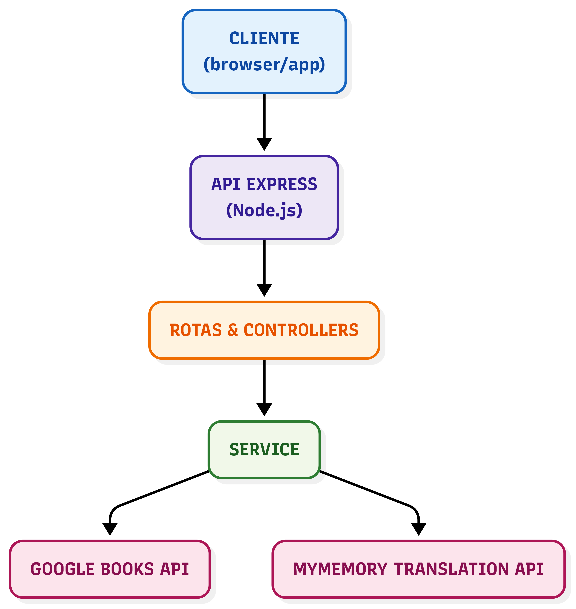

# BiblioConecta — README

> **API de Busca de Livros com Tradução**

---

## Objetivo do trabalho

O objetivo deste trabalho é desenvolver uma **API RESTful** capaz de realizar buscas de livros em fontes externas, como a **Google Books API**, e disponibilizar as informações no idioma português, mesmo quando a fonte original está em outro idioma. Para isso, a solução integra uma camada de tradução automática utilizando a **MyMemory Translation API**, oferecendo ao usuário uma experiência mais acessível e inclusiva ao consultar informações bibliográficas.

---

## Relação com os Objetivos de Desenvolvimento Sustentável (ODS)

O projeto BiblioConecta possui alinhamento direto com o **ODS 11 – Cidades e Comunidades Sustentáveis**, que busca tornar os espaços urbanos mais inclusivos, seguros, resilientes e sustentáveis.

A API proposta contribui para esse objetivo ao:

*   **Promover a inclusão digital e cultural**, disponibilizando descrições e metadados de livros em português, mesmo quando a fonte original está em outro idioma.
*   **Reduzir barreiras linguísticas**, permitindo que comunidades diversas e multiculturais tenham acesso facilitado à informação e ao conhecimento.
*   **Apoiar bibliotecas, escolas e universidades** na construção de plataformas digitais que democratizam o acesso à leitura, fortalecendo o papel da educação como elemento central para cidades mais sustentáveis.
*   **Estimular a inovação em ambientes urbanos**, ao fornecer uma solução tecnológica que pode ser integrada a aplicativos de leitura, hubs culturais e iniciativas de inclusão social.

## Descrição funcional da solução

A solução foi projetada para oferecer:

### Busca de livros

- Consulta unificada em fontes externas (Google Books API).
- Filtros por título, autor, ISBN ou palavra-chave.
- Suporte a paginação e limitação de resultados.

### Tradução integrada

- Tradução automática das descrições e metadados dos livros.
- Opção configurável para ativar/desativar tradução via parâmetro `translate`.
- Preservação de termos técnicos e nomes próprios durante a tradução.

### Documentação e usabilidade

- Rotas documentadas com Swagger/OpenAPI em `/docs`.
- Exemplos de uso disponíveis para Postman/Insomnia.

---

## Arquitetura da API

A API segue uma arquitetura modular, organizada em camadas:

- **Cliente** → navegador ou aplicativo que consome os endpoints.
- **API Express (Node.js)** → responsável por expor as rotas REST.
- **Rotas e Controllers** → controlam o fluxo das requisições HTTP.
- **Service** → camada responsável pela lógica de negócio e integração.
- **APIs externas** → Google Books API e MyMemory Translation API.

### Diagrama da Arquitetura




## Instruções de Execução

### 📌 Execução via Postman/Insomnia

1. Rode o comando `npm install` para instalar as dependências do projeto
2. Na sequência execute o comando `npm run dev` para rodar o projeto
3. No **Postman**: 
vá até `File > Import` e selecione o arquivo `./postman/collection.js` para importação das rotas e exemplos de uso.

No **Insomnia**: clique em Create ou no menu de Workspaces (canto superior esquerdo), selecione `Import Data > From File` e selecione o arquivo `./postman/collection.js`

### 📌 Documentação das Rotas

Documentação completa das rotas da API, incluindo parâmetros, exemplos de requisição e resposta.

#### 1. Endpoints

##### Livros

- **GET /api/livros** → Buscar livros por termo de pesquisa
- **GET /api/livros/:id** → Buscar detalhes de um livro por ID

#### 2. Parâmetros de requisição

##### **GET /api/livros**

- **query** _(obrigatório, string)_ → termo de busca (título, autor, etc.)
- **maxResults** _(opcional, inteiro)_ → número máximo de resultados (padrão: 12)
- **traduzir** _(opcional, string)_ → define se o título/descrição devem ser traduzidos para PT-BR.
      - `true` ou omitido → tradução ativada (padrão).
      - `false` → tradução desativada.

**Exemplo de requisição:**
`/api/livros?query=sigmund+freud&maxResults=2&traduzir=false`

##### **GET /api/livros/:id**

- **id** _(obrigatório, string)_ → identificador do livro no Google Books.

**Exemplo de requisição:**
`/api/livros/DhPUDwAAQBAJ`

#### 3. Formatos de resposta

##### Resposta de sucesso

###### Lista de livros (GET /api/livros)

```
{
  "success": true,
  "count": 1,
  "query": "sigmund freud",
  "traduzido": true,
  "livros": [
    {
            "id": 1,
            "titulo": "Sigmund Freud na sua época e em nosso tempo",
            "autor": "Elisabeth Roudinesco",
            "anoPublicacao": 2016,
            "isbn": "9788537815915",
            "descricao": "Uma obra fascinante, que nos apresenta um Freud mais humano...",
            "imagemCapa": "http://books.google.com/books/content?id=DhPUDwAAQBAJ&printsec=frontcover&img=1&zoom=1&edge=curl&source=gbs_api"
    }
  ]
}
```

###### Detalhe de livro (GET /api/livros)

```
{
    "success": true,
    "livro": {
        "id": "DhPUDwAAQBAJ",
        "titulo": "Sigmund Freud na sua época e em nosso tempo",
        "autor": "Elisabeth Roudinesco",
        "anoPublicacao": 2016,
        "isbn": "9788537815915",
        "descricao": "Uma obra fascinante, que nos apresenta um Freud mais humano...",
        "imagemCapa": "http://books.google.com/books/publisher/content?id=DhPUDwAAQBAJ&printsec=frontcover&img=1&zoom=1&edge=curl&imgtk=AFLRE708szLR5-b-uaNUkcagELjbItuaVUeefHnHgTVzDcIzoOs_CThr0tScqAnB6y6I_pcpu2V6G3EzQ9rCdnSFH_AIG-6wJVeIrpCYB7D7W7dB1kQj01b9YpCQPDEFrsdnlyavPG3p&source=gbs_api"
    },
    "traduzido": true
}
```

##### Respostas de erro

```
{  
    "error": "Parâmetro \"query\" é obrigatório"
}
```

```
{  
    "error": "Livro não encontrado",  
    "id": "zyTCAlFPjgYC"
}
```

#### 4. Exemplos de chamadas e respostas

##### Buscar livros

**Request:**
`GET /api/livros?query=sigmund+freud&maxResults=2&traduzir=true`

**Response:**

```
{
    "success": true,
    "count": 2,
    "query": "sigmund freud",
    "traduzido": true,
    "livros": [
        {
            "id": 1,
            "titulo": "Sigmund Freud na sua época e em nosso tempo",
            "autor": "Elisabeth Roudinesco",
            "anoPublicacao": 2016,
            "isbn": "9788537815915",
            "descricao": "Uma obra fascinante, que nos apresenta um Freud mais humano...",
            "imagemCapa": "http://books.google.com/books/content?id=DhPUDwAAQBAJ&printsec=frontcover&img=1&zoom=1&edge=curl&source=gbs_api"
        },
       
        {
            "id": 2,
            "titulo": "Edição Standard Brasileira das Obras Psicológicas Completas de Sigmund Freud Volume XIV",
            "autor": "SIGMUND FREUD",
            "anoPublicacao": 2006,
            "isbn": "9788531211232",
            "descricao": "“Em 1948 o Instituto de Psicanálise de Londres e The Hogarth Press...",
            "imagemCapa": "http://books.google.com/books/content?id=fOzUDAAAQBAJ&printsec=frontcover&img=1&zoom=1&edge=curl&source=gbs_api"
        }
    ]
}
```

##### Detalhes de um livro

**Request:**
`GET /api/livros/DhPUDwAAQBAJ`

**Response:**

```
{
    "success": true,
    "livro": {
        "id": "DhPUDwAAQBAJ",
        "titulo": "Sigmund Freud na sua época e em nosso tempo",
        "autor": "Elisabeth Roudinesco",
        "anoPublicacao": 2016,
        "isbn": "9788537815915",
        "descricao": "Uma obra fascinante, que nos apresenta um Freud mais humano...",
        "imagemCapa": "http://books.google.com/books/publisher/content?id=DhPUDwAAQBAJ&printsec=frontcover&img=1&zoom=1&edge=curl&imgtk=AFLRE73dV4e543sUyAxz7ioPk_3sFs3z4OtfNIOcXaODbq351Eb8GRPRWevo13XPlknEcMuHqMruDEfY12coVQaHQfEe0wAmKncPuxFbvlzicSlPQV8dfcJRlARu5wh11xHoV1ODoBZH&source=gbs_api"
    },
    "traduzido": true
}
```

#### 5. Documentação via Swagger

##### a) Instale as dependências
No terminal, dentro da pasta do projeto:
```
npm install
```

##### b) Rode o servidor
Execute:
```
npm run dev
```

O servidor será iniciado na porta 3000 (confirmação em src/server.ts).

##### c) Acesse a documentação via Swagger
Abra o navegador e acesse o endereço:
`http://localhost:3000/api-docs`

A documentação interativa estará disponível, conforme a configuração encontrada em src/swagger.ts.
---
