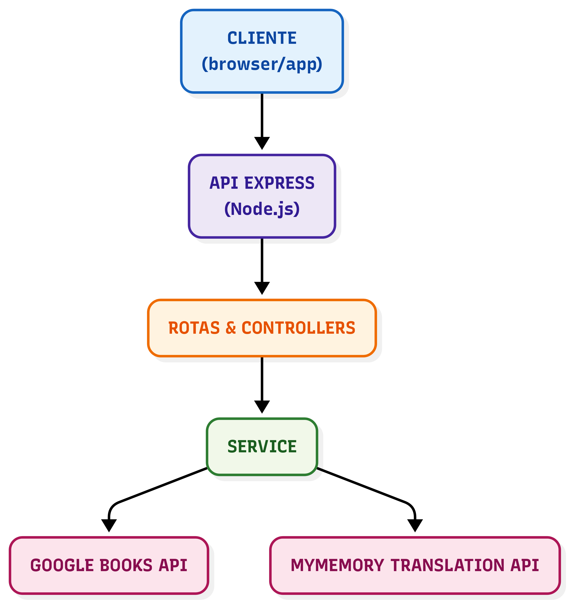

## Arquitetura da API

A API segue uma arquitetura modular, organizada em camadas:

* **Cliente** → navegador ou aplicativo que consome os endpoints.
* **API Express (Node.js)** → responsável por expor as rotas REST.
* **Rotas e Controllers** → controlam o fluxo das requisições HTTP.
* **Service** → camada responsável pela lógica de negócio e integração.
* **APIs externas** → Google Books API e MyMemory Translation API.

### Diagrama da Arquitetura

